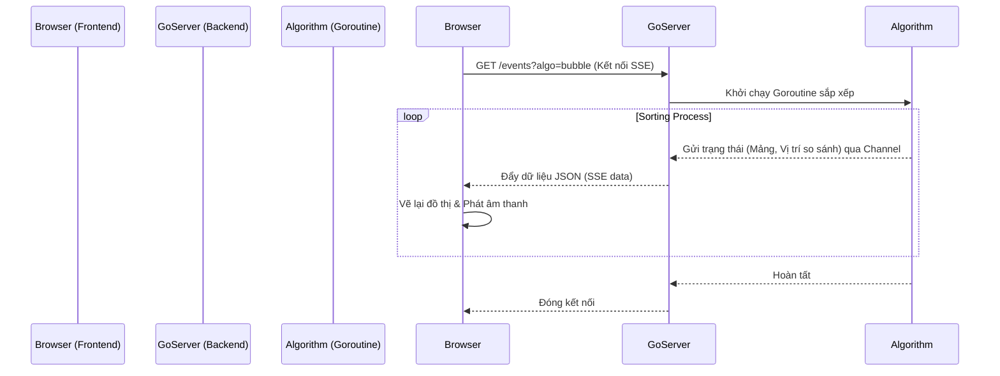

# Sorting Algorithms Visualizer - Kiến trúc và Cách hoạt động

Dự án này là một ứng dụng web trực quan hóa các thuật toán sắp xếp (Sorting Algorithms) theo thời gian thực, kết hợp giữa **Golang** (Backend) và **HTML/JS** (Frontend).

## 1. Kiến trúc tổng quan

Hệ thống hoạt động theo mô hình **Server-Sent Events (SSE)**, cho phép server chủ động đẩy dữ liệu xuống trình duyệt mà không cần client phải liên tục gửi request.

---

## 2. Chi tiết từng thành phần

### A. Backend (Golang) - `visualizer/main.go`

Backend đóng vai trò là "bộ não", thực hiện việc sắp xếp và điều phối luồng dữ liệu.

1.  **Web Server:** Sử dụng thư viện chuẩn `net/http` để phục vụ file tĩnh (`index.html`) và endpoint `/events`.
2.  **SSE Handler (`handleSSE`):**
    *   Thiết lập header `Content-Type: text/event-stream` để trình duyệt hiểu đây là luồng sự kiện.
    *   Tạo một `channel` để nhận dữ liệu từ thuật toán sắp xếp.
    *   Chạy thuật toán sắp xếp trong một **Goroutine** riêng biệt để không chặn luồng chính của server.
3.  **Thuật toán Visual (`bubbleSortVisual`, `quickSortVisual`...):**
    *   Thay vì chỉ sắp xếp mảng, các hàm này chèn thêm bước gửi dữ liệu vào channel sau mỗi thao tác so sánh hoặc hoán đổi.
    *   Sử dụng `time.Sleep(Delay)` để làm chậm quá trình, giúp người dùng kịp quan sát.
    *   Dữ liệu gửi đi bao gồm: Mảng hiện tại, Index các phần tử đang tương tác, Trạng thái (text).

### B. Frontend (HTML/JS/CSS) - `visualizer/index.html`

Frontend đảm nhiệm việc hiển thị và tương tác người dùng.

1.  **EventSource API:**
    *   Dùng để kết nối đến `/events` của server.
    *   Lắng nghe sự kiện `onmessage` để nhận dữ liệu JSON từ server.
2.  **Rendering (Vẽ đồ thị):**
    *   Mỗi khi nhận được mảng mới, hàm `renderBars` sẽ xóa container cũ và vẽ lại các thanh bar mới.
    *   Chiều cao thanh bar tương ứng với giá trị số.
    *   Các thanh đang được so sánh (dựa vào `compareIdx` gửi từ server) sẽ được tô màu đỏ (`.active`).
    *   Số giá trị được hiển thị ngay trên đầu mỗi thanh.
3.  **Web Audio API (Âm thanh):**
    *   Sử dụng `AudioContext` và `OscillatorNode` để tạo âm thanh trực tiếp trên trình duyệt.
    *   **Mapping:** Giá trị của số (1-100) được ánh xạ sang tần số các nốt nhạc chuẩn (C, D, E...).
    *   **Envelope (ADSR):** Điều chỉnh âm lượng theo thời gian (tăng nhanh, giảm từ từ) để mô phỏng tiếng gõ của đàn Piano, tránh tiếng "bụp" (clipping) khó chịu.

## 3. Luồng dữ liệu (Data Flow)

1.  Người dùng chọn thuật toán (ví dụ: Quick Sort) và bấm "Bắt đầu".
2.  Frontend gọi `new EventSource("/events?algo=quick")`.
3.  Backend nhận request, khởi tạo mảng ngẫu nhiên.
4.  Backend chạy `quickSortVisual` trong background.
5.  Khi thuật toán so sánh 2 số `arr[i]` và `arr[j]`:
    *   Backend gửi event: `{ "arr": [...], "compareIdx": [i, j], "status": "So sánh" }`.
    *   Frontend nhận event -> Tô đỏ thanh `i` và `j` -> Phát nốt nhạc tương ứng với giá trị `arr[i]` và `arr[j]`.
6.  Khi thuật toán hoán đổi (swap):
    *   Backend cập nhật mảng và gửi event mới.
    *   Frontend vẽ lại mảng với vị trí mới.
7.  Quá trình lặp lại cho đến khi mảng được sắp xếp xong.

## 4. Tại sao chọn kiến trúc này?

*   **Real-time:** SSE là lựa chọn hoàn hảo cho việc truyền dữ liệu một chiều liên tục (Server -> Client) mà nhẹ hơn WebSocket.
*   **Decoupling:** Thuật toán sắp xếp chạy độc lập trên server (Go rất mạnh về concurrency), frontend chỉ việc hiển thị những gì nhận được (dumb UI).
*   **Performance:** Go xử lý logic tính toán nhanh, JS xử lý render và âm thanh linh hoạt.
